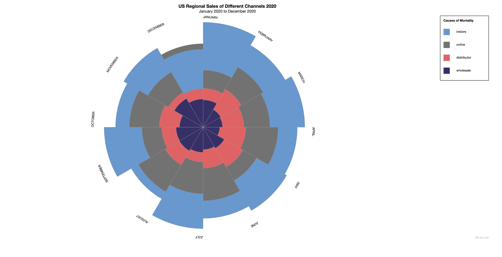

## Task B

This repo is for task B of otot task. The project creates Rose Chart for viewing different sales channel data in United States for year 2020

## How to use

- Install python3
- run it with

```
python3 -m http.server
```

- open it with the port showing in the terminal and add /rosechart.html on the url, for example:

```
localhost:8000/rosechart.html
```

## Demo


